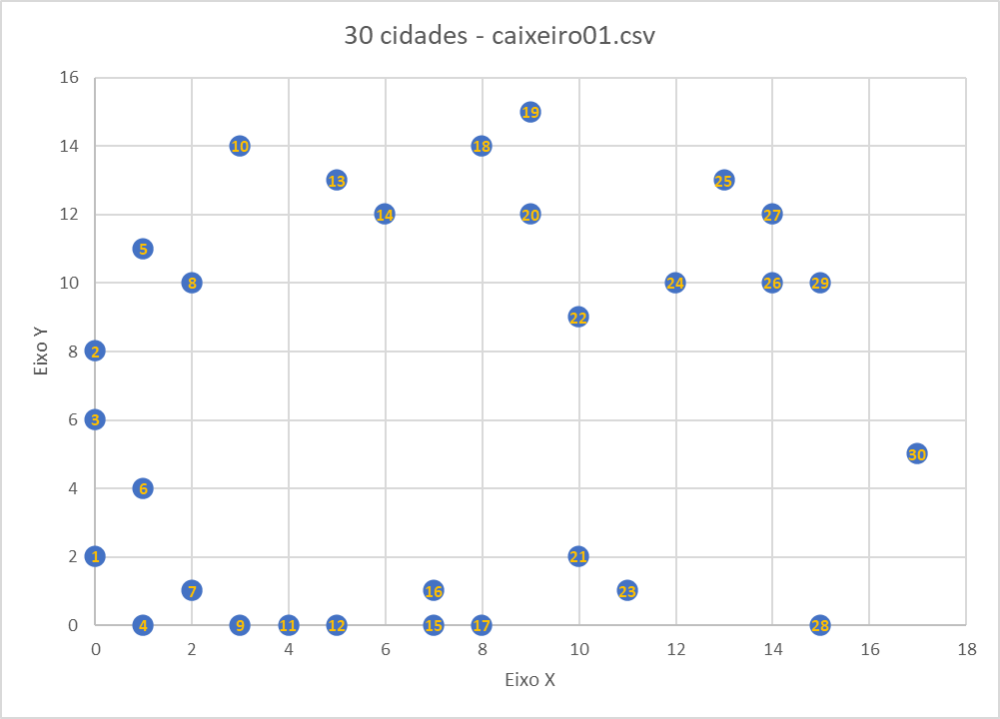
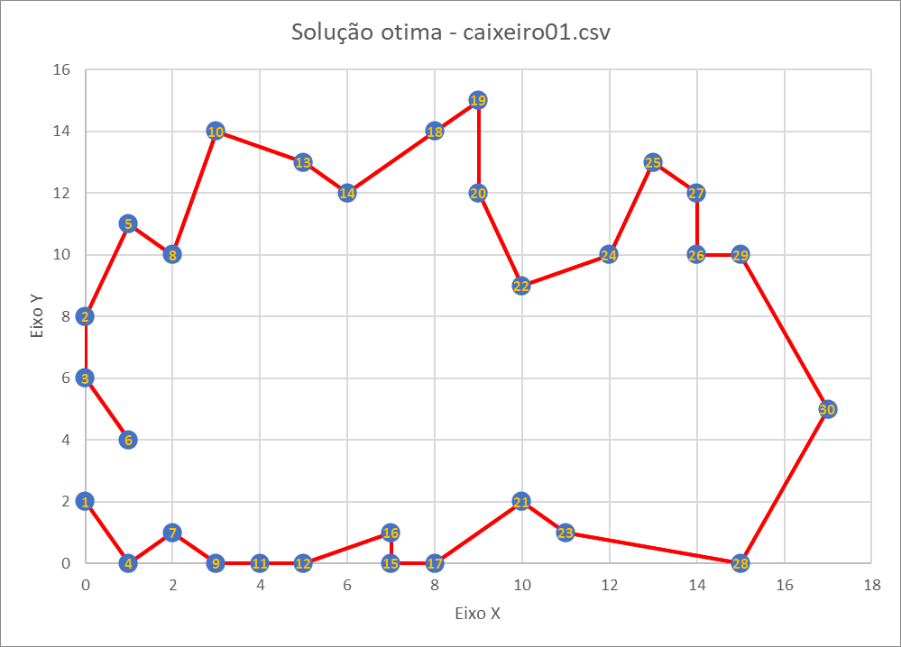
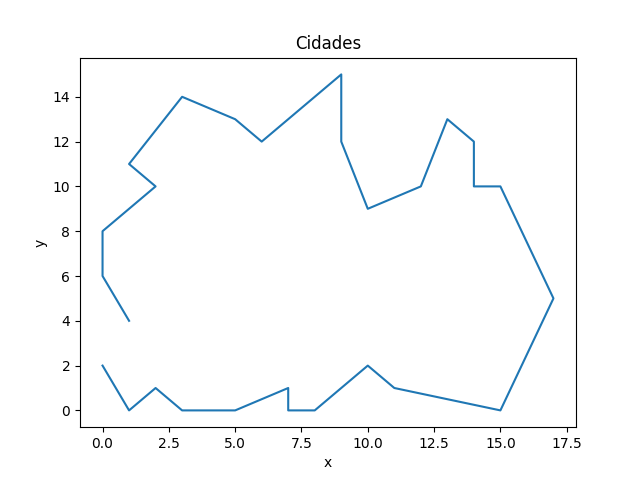
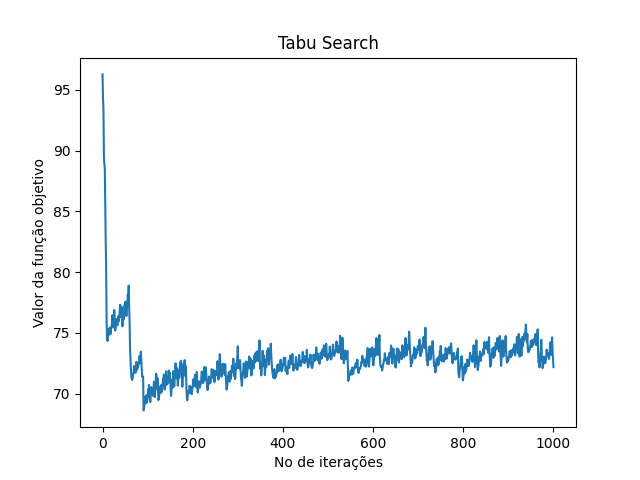

# Tabu Search Básico para TSP
Desenvolvimento do algoritmo Tabu Search (Busca Tabu) básico para o resoluçãodo TSP.

A lista tabu armazena a solução inteira, e por tanto, não utiliza atributo proibido ou critério de aspiração.

A solução vizinha se obtem trocando duas cidades no vetor.

### Coordenadas das cidades (modelo para teste)
Na tabela abaixo estão dispostas as coordenadas x e y para 30 cidades.

| cidade  |   x   |   y   |
|:-------:|:-----:|:-----:|
|    1    |   0   |   2   |
|    2    |   0   |   8   |
|    3    |   0   |   6   |
|    4    |   1   |   0   |
|    5    |   1   |  11   |
|    6    |   1   |   4   |
|    7    |   2   |   1   |
|    8    |   2   |  10   |
|    9    |   3   |   0   |
|   10    |   3   |  14   |
|   11    |   4   |   0   |
|   12    |   5   |   0   |
|   13    |   5   |  13   |
|   14    |   6   |  12   |
|   15    |   7   |   0   |
|   16    |   7   |   1   |
|   17    |   8   |   0   |
|   18    |   8   |  14   |
|   19    |   9   |  15   |
|   20    |   9   |  12   |
|   21    |  10   |   2   |
|   22    |  10   |   9   |
|   23    |  11   |   1   |
|   24    |  12   |  10   |
|   25    |  13   |  13   |
|   26    |  14   |  10   |
|   27    |  14   |  12   |
|   28    |  15   |   0   |
|   29    |  15   |  10   |
|   30    |  17   |   5   |

### Plano cartesiano com 30 cidades

### Tour/Rota ótima

A solução ótima que o algoritmo deve encontrar é a seguinte:

### Resultados do algoritmo TS Básico

Tempo de execução: 105.21347522735596 seg

Valor incumbente:  68.62472601153637

Melhor rota: [1, 4, 7, 9, 11, 12, 16, 15, 17, 21, 23, 28, 30, 29, 26, 27, 25, 24, 22, 20, 19, 18, 14, 13, 10, 5, 8, 2, 3, 6]

